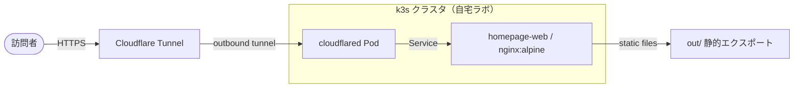

# tagomori_homepage

**田籠0211（HN）** の公開ホームページ本体です。
自宅ラボ（homelab）を観測し、判断し、改善した記録を、Next.js の静的エクスポートとして配信します。

[](https://github.com/Tagomori0211/tagomori_homepage/actions/workflows/deploy-homepage.yml)
[](https://github.com/Tagomori0211/tagomori_homepage/actions/workflows/dry-run-connectivity.yml)
[](./LICENSE)
[](https://github.com/Tagomori0211/tagomori_homepage/commits/main)

[](https://nextjs.org/)
[](https://react.dev/)
[](https://www.typescriptlang.org/)
[](./Dockerfile)
[](./k8s/homepage)
[](./nginx.conf)
[](./k8s/homepage/cloudflared-deployment.yaml)
[](./.github/workflows)

---

## このサイトが示すこと

- **メインストーリー**: 観測 → 判断 → 改善。コスト約 4.5 倍まで膨らんだ Minecraft ワークロードの構成を GKE から GCE + Docker Compose へ切り替え、月間コストを約 75% 削減。振り返りは blameless。
- **公開サイトフローと物理ネットワーク**
  - 公開サイト: 訪問者 → Cloudflare Tunnel → cloudflared → Service → nginx Pod
  - 物理ネットワーク: 要約のみ。正本は [tagomori-homelab](https://github.com/Tagomori0211/tagomori-homelab) の README（TX2540 M1 → Ryzen 5700G、10GbE デイジーチェーン、ノード選定・コスト試算など）
- **プロジェクト一覧**: GitHub の公開リポジトリへのリンク（`data/repos.ts` で管理。追加・説明変更はこのファイルだけ直す）
- 障害・運用の短い原則、秘密を含まない再現手順、連絡導線

ゲーム宣伝や監視ダッシュボードの実装そのものはこのリポの範囲外です（それぞれ別リポで管理）。

## アーキテクチャ



インバウンドポートは開けません。`cloudflared` がアウトバウンドで Tunnel を張り、Service 経由で nginx の静的ファイルを返す構成です。秘密・証明書・トンネル資格情報はリポに含まれません。

## サイト構成

| § | セクション | 内容 |
|---|-----------|------|
| 01 | 自己紹介 | 経歴・学歴・志望動機 |
| 02 | 技術スタック | IaC / コンテナ / 監視 / CI/CD / ネットワークのスキル一覧 |
| 03 | 学習の軌跡 | 独学開始から現在までのマイルストーン |
| 04 | メインストーリー | 観測 → 判断 → 改善のコスト削減記録 |
| 05 | 公開サイトフローと物理ネットワーク | 論理パス図と物理構成の要約 |
| 06 | プロジェクト | GitHub 公開リポジトリ一覧 |
| 07 | 障害・運用の原則 | blameless な運用ポリシー |
| 08 | 当サイトのデプロイ手順 | 秘密なしで再現できるビルド・配信手順 |
| 09 | 連絡 | メール / GitHub / X |

## 技術方針

| 項目 | 内容 |
|------|------|
| フレームワーク | Next.js 16 (App Router) |
| 出力 | `output: 'export'`（静的 `out/`） |
| 画像 | `images.unoptimized: true` |
| 言語 | TypeScript + シンプルな CSS（外部 CDN に依存しない） |
| Lint | ESLint 9（flat config, `eslint-config-next`） |
| パッケージ | npm（lockfile あり） |
| コンテナ | multi-stage: `next build` → `nginx:alpine` で `out/` 配信 |
| 配信 | k3s（自宅ラボ）→ Cloudflare Tunnel（インバウンドポート開放なし） |
| CI/CD | GitHub Actions（`deploy-homepage`, `dry-run-connectivity`） |

## ローカルビルド

要件: **Node.js 20+**

```bash
npm install
npm run build   # → out/ に静的ファイルが生成される
npm run lint    # ESLint
```

開発サーバ（任意）:

```bash
npm run dev
```

## Docker

```bash
docker build -t tagomori-homepage .
docker run --rm -p 8080:80 tagomori-homepage
# → http://localhost:8080/
```

秘密・`.env`・トンネル資格情報はイメージに含めません。

## デプロイ

```bash
kubectl apply -f k8s/homepage/
```

`push` すると GitHub Actions が GHCR にイメージを積み、Tailscale 経由で k3s に apply します。詳細は [docs/iap-deploy.md](./docs/iap-deploy.md)（値・トークンなしの設計メモ）を参照してください。

## 関連リポジトリ

| リポジトリ | 説明 |
|-----------|------|
| [tagomori-homelab](https://github.com/Tagomori0211/tagomori-homelab) | 自宅ラボの物理構成図。10GbE デイジーチェーン、ノード選定、コスト試算の正本 |
| [Minecraft-on-Kubernetes](https://github.com/Tagomori0211/Minecraft-on-Kubernetes) | Minecraft クラスタ運用。Terraform (HCL) と Kubernetes による IaC 管理 |
| [cloud-observability-gateway](https://github.com/Tagomori0211/cloud-observability-gateway) | Flutter を用いたクロスプラットフォーム監視ダッシュボード基盤 |

全リポジトリは [github.com/Tagomori0211](https://github.com/Tagomori0211?tab=repositories) から確認できます。

## ライセンス

MIT — 詳細はリポジトリルートの [LICENSE](./LICENSE) を参照。
